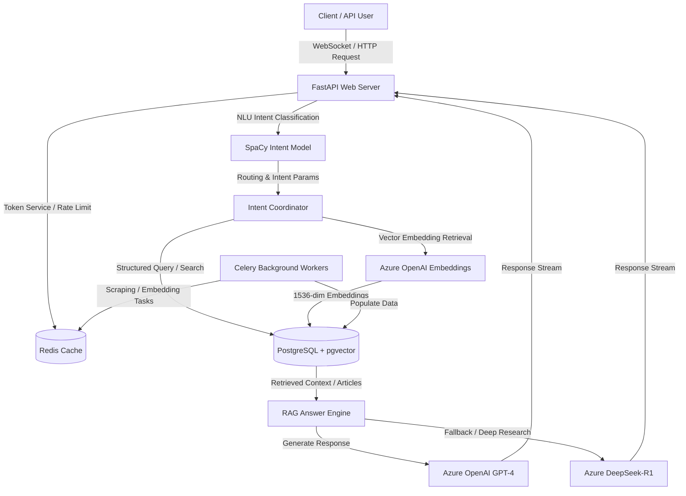

# Investment Market Research Agent

An AI-powered research agent for funding analysis, startup intelligence, and investment market research.

This project was originally built for **Doriot AI**, that is now closed. The codebase has since been cleaned up and made public as a standalone backend project.

The agent uses a Retrieval-Augmented Generation architecture with a custom multi-label intent classifier to understand user queries, route them to the right research workflow, and generate structured investment insights. It combines SQL-based search over structured funding data with vector search over scraped startup and market news, allowing it to answer questions about funding rounds, competitors, market trends, lead generation, and startup activity.

The backend is built with FastAPI, PostgreSQL, pgvector, Redis, Celery, and Azure OpenAI, with support for fallback reasoning models.

---

## 🚀 Key Features

* **Multi-Label NLU Routing:** Employs a custom-trained **SpaCy Text Classifier** to identify user intents across 20+ specialized categories (e.g., funding round details, competitor lookup, lead generation, market trends).
* **Advanced RAG Engine:** Hybrid retrieval combining direct SQL query execution over structured relational data with semantic vector search over tech news and scraped articles.
* **Dual-Model LLM Strategy:** Uses **Azure OpenAI (GPT-4)** for core reasoning, with seamless fallback support to **DeepSeek-R1** (via Azure AI Inference SDK) for long-form reasoning, deep research, and backup processing.
* **PGVector Search:** Operates over a PostgreSQL database utilizing the `pgvector` extension to perform high-dimensional cosine similarity searches on 1536-dimensional article embeddings.
* **Data Ingestion Scrapers:** Built-in crawlers for TechCrunch (Startups and Venture sections) and a NewsAPI ingestor for continuous startup funding news fetch.
* **Production Architecture:** FastAPI application with asynchronous endpoints, streaming response support, Redis-based Celery background workers, rate limiting, and Prometheus-based monitoring/metrics.

---

## 🏗️ Architecture Overview

The system operates as a modular, backend-heavy API. The user interacts through a REST/WebSocket API hosted on FastAPI, which coordinates requests as follows:



---

## 📁 Repository Structure

```text
├── app/                        # Main FastAPI backend application
│   ├── api/                    # OpenAPI / Swagger API documentation definitions
│   ├── classifier_model/       # Trained SpaCy intent classification model
│   ├── core/                   # Configuration, DB connection, Redis, Celery setup
│   ├── dependencies.py         # FastAPI request dependencies (e.g., authentication)
│   ├── main.py                 # Application entry point
│   ├── middleware/             # HTTP middlewares (logging, metrics, CORS)
│   ├── migrations/             # Database migrations (Alembic configuration and scripts)
│   ├── models/                 # SQLAlchemy models representing the database schema
│   ├── monitoring/             # Prometheus and application health monitoring
│   ├── rag/                    # Advanced RAG logic, query handlers, and searchers
│   ├── repositories/           # Database access layer pattern
│   ├── routes/                 # FastAPI routes (authentication, chat, health, registration)
│   └── services/               # Business logic services (chat history, token limits)
│
├── db-scripts/                 # Database initialization, migration, and scraping scripts
│   ├── Create_DB_Schema.py     # SQL schema builder
│   ├── Joining_all_articles.py # Script migrating and consolidation tables
│   ├── aws_pgvector_setup.py   # Setup pgvector extension & indexes on AWS RDS
│   ├── embedding_db_tables.py  # Script to embed scraped articles
│   ├── google_news_fetcher.py  # NewsAPI fetcher script
│   └── techcrunch_scraper.py   # Scraper for TechCrunch startup news
│
├── model/                      # Model training directory
│   ├── training.py             # Spacy multilabel model training script
│   ├── training_data.py        # Synthetic intent classification generation data
│   └── intent_classification_with_bert.ipynb # BERT implementation reference notebook
│
├── requirements.txt            # Python environment dependencies
└── README.md                   # Project documentation
```

---

## 🛠️ Setup and Installation

### 1. Prerequisites
Ensure you have the following installed on your machine:
* Python 3.10+
* PostgreSQL (with `pgvector` extension support)
* Redis (for Celery broker and token storage)

### 2. Clone and Prepare Virtual Environment
```bash
git clone https://github.com/your-username/doriot-market-research-agent.git
cd doriot-market-research-agent

# Create a virtual environment
python -m venv env
source env/bin/activate

# Install dependencies
pip install -r requirements.txt
```

### 3. Configure Environment Variables
Create a `.env` file in the root directory and populate it with your credentials:

```ini
# Application configuration
SECRET_KEY=your_jwt_secret_key_here
ENVIRONMENT=development
LOG_LEVEL=INFO

# Database Settings
DB_NAME=market_research
DB_USER=postgres
DB_PASSWORD=your_password
DB_HOST=localhost
DB_PORT=5432

# Redis Configuration (For local development)
REDIS_LOCAL_HOST=localhost
REDIS_LOCAL_PORT=6379

# Celery local brokers
CELERY_LOCAL_BROKER_URL=redis://localhost:6379/1
CELERY_LOCAL_RESULT_BACKEND=redis://localhost:6379/2

# API Keys & Endpoints (Choose "openai" or "azure" for OPENAI_TYPE)
OPENAI_TYPE=azure

# If using Azure OpenAI:
AZURE_OPENAI_VERSION=2023-12-01-preview
AZURE_OPENAI_ENDPOINT=https://your-endpoint.openai.azure.com/
AZURE_OPENAI_KEY=your_azure_openai_key
AZURE_OPENAI_EMBEDDING_DEPLOYMENT=text-embedding-ada-002
AZURE_OPENAI_CHAT_DEPLOYMENT=gpt-4

# If using standard OpenAI:
OPENAI_API_KEY=your_standard_openai_key

# DeepSeek Backup Model (Azure AI Inference SDK)
AZURE_DEEPSEEK_KEY=your_azure_deepseek_key
AZURE_DEEPSEEK_ENDPOINT=https://your-deepseek-endpoint.services.ai.azure.com/models
AZURE_DEEPSEEK_API_VERSION=2024-05-01-preview
AZURE_DEEPSEEK_MODEL=DeepSeek-R1

# NewsAPI Key for Ingestion
NEWS_API_KEY=your_news_api_key_here
```

### 4. Database Setup & Migrations
Ensure your Postgres instance is running and create the target database. Run the schema creation and pgvector index configurations:

```bash
# Run database schema generator
python db-scripts/Create_DB_Schema.py

# Install pgvector extension and create similarity search indexes
python db-scripts/aws_pgvector_setup.py
```

If you prefer using Alembic migrations:
```bash
cd app
alembic upgrade head
cd ..
```

---

## 📥 Ingestion & Scraping Data

To populate the database with startup information, articles, and generate embeddings for them:

```bash
# 1. Run the TechCrunch crawler to scrape articles
python db-scripts/techcrunch_scraper.py

# 2. Ingest startup funding news using NewsAPI
python db-scripts/google_news_fetcher.py

# 3. Consolidate and join articles tables
python db-scripts/Joining_all_articles_tables.py

# 4. Generate embeddings for all scraped articles
python db-scripts/embedding_db_tables.py
```

---

## 🏃 Running the Application

### Running the API Server (FastAPI)
Launch the API using `uvicorn`:
```bash
uvicorn app.main:app --host 0.0.0.0 --port 8000 --reload
```
You can access the Swagger UI documentation at `http://localhost:8000/docs`.

### Running Celery Background Workers
For asynchronous scraping, data updates, or monitoring jobs:
```bash
# Run worker
celery -A app.core.celery.worker worker --loglevel=info
```

---

## 🧠 Intent Classification & Training

The NLU routing is based on SpaCy's multi-label categorization. The configuration and model parameters are saved under `app/classifier_model/`.

To re-train or refine the intent classifier:
1. Navigate to the `model` folder.
2. Edit `training_data.py` to add new utterances or intents.
3. Run the training script:
   ```bash
   python model/training.py
   ```
   This will train the model and save the artifact directly into `app/classifier_model/intent_model`.

---

## 🛡️ License

This project is open-source and available under the [MIT License](LICENSE).
